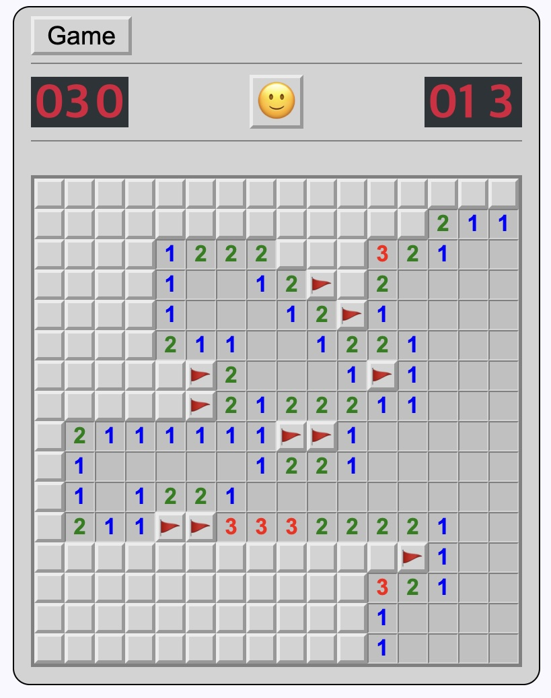
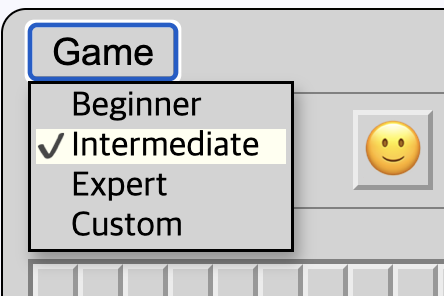
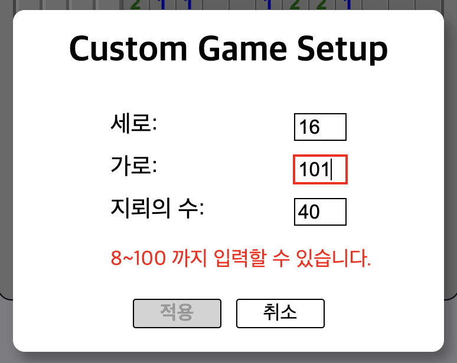
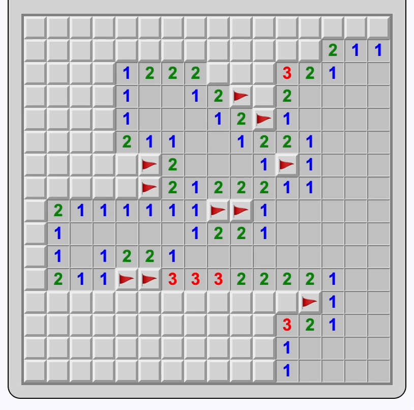

# ts-google-forms

typescript + React + Redux로 구현한 지뢰 찾기입니다.

## Play Demo

https://ts-minesweeper.vercel.app/

## 기술스택

- Vite
- React + TypeScript
- Redux + Redux Toolkit
- Styled-components

## Getting Started

`npm install`

`npm run dev`

open http://localhost:5173/

## 주요 기능

- 난이도 설정

  

  - Beginner (8 X 8) 지뢰 10개
  - Intermediate (16 X 16) 지뢰 40개
  - Expert (32 X 16) 지뢰 100개
  - Custom (8~100 X 8~100) 지뢰 1 ~ Cell 개수의 1/3 설정 가능

    

  - 브라우저에 설정 저장

- 우클릭 깃발
- 양클릭 Area Open

  
